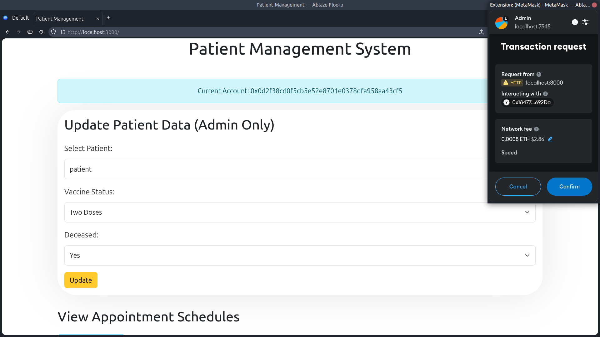
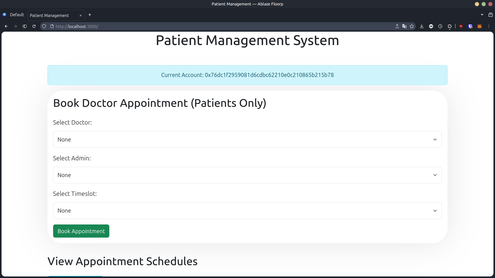
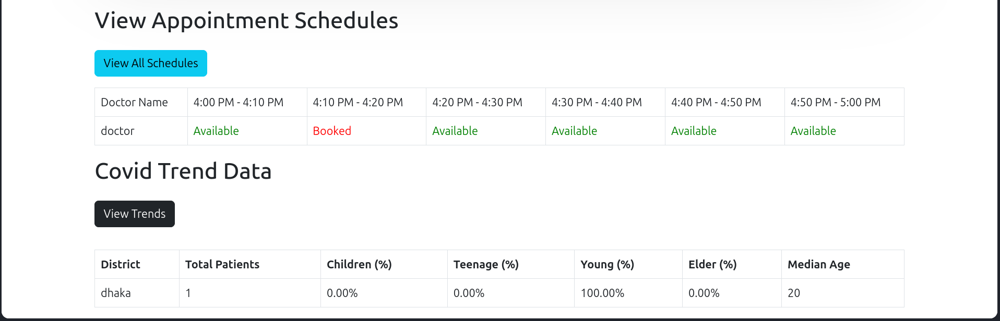

# GuardianAI

GuardianAI is a blockchain-based healthcare platform that securely manages patient records, facilitates doctor appointments, and provides AI-driven health insights. It uses Ethereum smart contracts to store medical data, ensuring privacy and immutability. Patients can register, maintain their health records, and book verified doctors through a decentralized appointment system. AI integration analyzes symptoms and provides preliminary health recommendations, improving access to medical guidance. Doctors can access authorized patient records, update diagnoses, and manage their appointment schedules. MetaMask integration enables secure blockchain transactions, ensuring transparency and user control over medical data.

---

## Features

✅ Decentralized Medical Records – Uses blockchain to securely store and manage patient data, ensuring privacy and ownership.

✅ AI-Powered Health Assessment – Provides preliminary health insights based on symptoms before doctor consultations.

✅ Doctor Verification System – Ensures only certified professionals can offer consultations, reducing fraud.

✅ Smart Contract-Based Payments – Enables transparent and secure transactions without intermediaries.

✅ Encrypted Data Storage – Protects sensitive medical records using advanced encryption techniques.

✅ User-Controlled Access – Patients decide who can view or modify their health data.

✅ Remote Healthcare Access – Allows patients in remote areas to consult verified doctors online.


---

## Environment Setup
Following commands are tested on Linux.

If you want more through instructions, please visit the following [Tutorial](https://github.com/YEASIN49/CSE446-Content/blob/main/Ethereum%20Dapp/README.mdche/) made by Yeasin sir. 

### Prerequisites
1. **Install Node Version Manager (nvm):**
   ```bash
   curl -o- https://raw.githubusercontent.com/nvm-sh/nvm/v0.39.2/install.sh | bash
   ```

2. **Install Node.js (v18.15.0):**
   ```bash
   nvm install 18.15.0
   nvm alias default 18.15.0
   ```

3. **Install Truffle:**
   ```bash
   npm install -g truffle
   ```

4. **Install Ganache:**
   - Download from [Ganache](https://trufflesuite.com/ganache/)
   - Install additional tools:
     ```bash
     sudo add-apt-repository universe && sudo apt install libfuse2
     ```
   - Make the downloaded file executable and run it.

5. **Install MetaMask:**
   - Go to [MetaMask](https://metamask.io/) and install the extension for your preferred browser.
   - Follow the on-screen instructions to set up MetaMask.

### Connecting MetaMask to Ganache
1. **Add Network Manually in MetaMask:**
   - Network Name: localhost:7545
   - New RPC URL: http://127.0.0.1:7545
   - Chain ID: 1337
   - Currency Symbol: ETH

2. **Import Ganache Account to MetaMask:**
   - Copy the private key from Ganache.
   - Import the account in MetaMask using the private key.

---

## Installation
1. Clone the repository.
2. Start Ganache and create a new workspace.
3. Compile and deploy the smart contracts using Truffle:
    ```bash
    truffle compile
    truffle migrate
    ```
4. Install the required packages:
    ```bash
    npm install
    ```
5. Start the React app:
    ```bash
    npm run dev
    ```
6. Open the app in your browser at `http://localhost:3000/`.

---

## Screenshots

### Registration Page (Admin & Doctor)
The landing page of the app where the user can register as an Admin, Doctor, or Patient. Switching the account from MetaMask will change the role of the user. The first account of Ganache is an Admin account. If logged in as the first account, the landing page will directly take you to the Admin dashboard. Change the account to another account from Ganache to see the registration page.


### Registration Page (Patient)
Here patients can register by providing their details. Every time you register a new patient, a new transaction is created in the blockchain.


### Admin Dashboard
Here you will be able to update patient information.


### Patient Dashboard
Here you will be able to book an appointment with a doctor. You can also view if the doctor is booked at a particular time.

Every time a patient books an appointment, the selected admin gets one ether as a fee.


### Doctor Schedule
Here the doctor can view their schedule and appointments with information like how many patients registered and their age.


---

## How to Contribute
1. Fork the repository.
2. Push your changes to a new branch.
3. Create a pull request.
4. Wait for the pull request to be reviewed.
